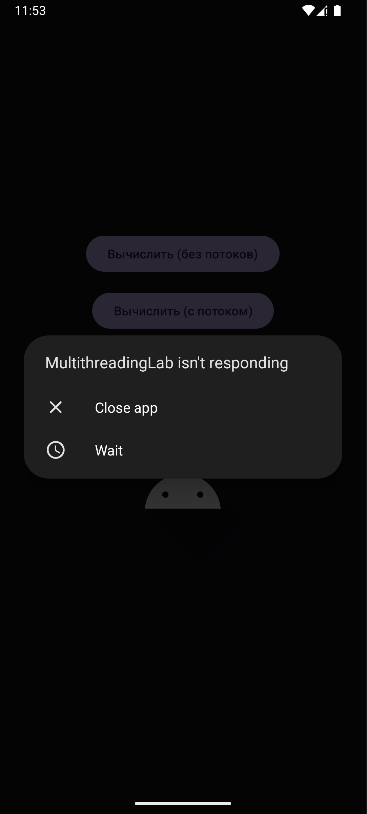
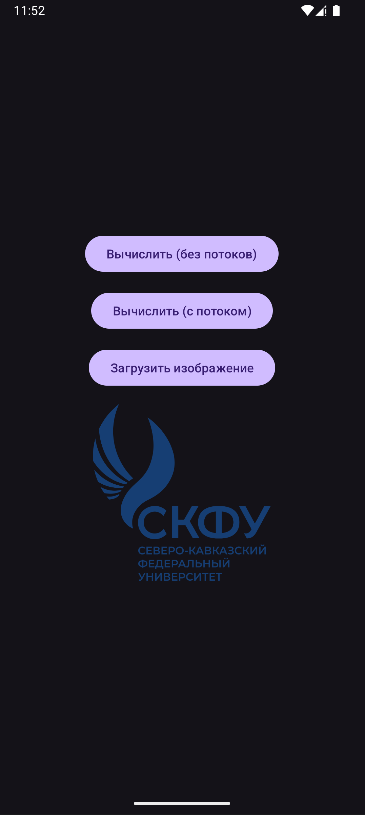
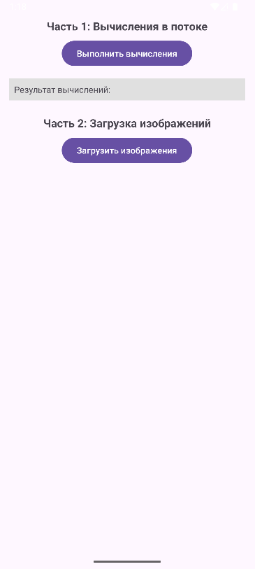
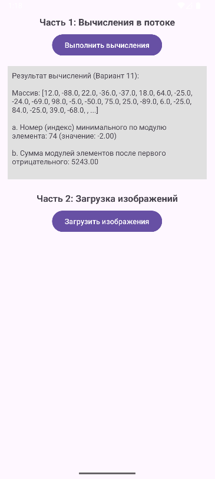
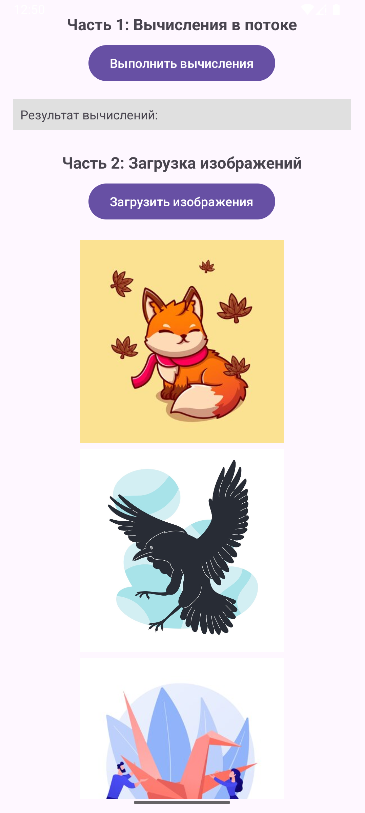

<div align="center">

# Отчёт

</div>

<div align="center">

## Практическая работа №11

</div>

<div align="center">

## Многопоточность в Android. Асинхронная загрузка данных.

</div>

**Выполнил:** Деревянко Артём Владимирович<br>
**Курс:** 2<br>
**Группа:** ИНС-б-о-24-2<br>
**Направление:** 09.03.02 Информационные системы и технологии<br>
**Проверил:** Потапов Иван Романович

---

### Цель работы
Изучить принципы многопоточного программирования в Android. Научиться выносить длительные операции (вычисления, загрузка данных из сети) в фоновые потоки, чтобы избежать блокировки пользовательского интерфейса. Освоить способы обновления UI из фоновых потоков.

### Ход работы
#### Задание 1: Создание проекта и подготовка интерфейса
1. Был открыт Android Studio и создан новый проект с шаблоном **Empty Views Activity**. Проекту дано имя `MultithreadingLab`.
2. В файле `activity_main.xml` создан интерфейс для выполнения вычислений и загрузки изображений.
##### activity_main.xml
```xml
<LinearLayout xmlns:android="http://schemas.android.com/apk/res/android"
    android:layout_width="match_parent"
    android:layout_height="match_parent"
    android:orientation="vertical"
    android:padding="16dp"
    android:gravity="center">

    <Button
        android:id="@+id/btnCalculate"
        android:layout_width="wrap_content"
        android:layout_height="wrap_content"
        android:text="Вычислить (без потоков)"
        android:layout_marginBottom="16dp"/>

    <Button
        android:id="@+id/btnCalculateThread"
        android:layout_width="wrap_content"
        android:layout_height="wrap_content"
        android:text="Вычислить (с потоком)"
        android:layout_marginBottom="16dp"/>

    <Button
        android:id="@+id/btnLoadImage"
        android:layout_width="wrap_content"
        android:layout_height="wrap_content"
        android:text="Загрузить изображение"
        android:layout_marginBottom="16dp"/>

    <ProgressBar
        android:id="@+id/progressBar"
        style="?android:attr/progressBarStyleHorizontal"
        android:layout_width="match_parent"
        android:layout_height="wrap_content"
        android:max="100"
        android:visibility="gone"
        android:layout_marginBottom="16dp"/>

    <ImageView
        android:id="@+id/imageView"
        android:layout_width="200dp"
        android:layout_height="200dp"
        android:layout_gravity="center_horizontal"
        android:src="@drawable/ic_launcher_foreground"/>

</LinearLayout>
```

#### Задание 2: Демонстрация "зависания" интерфейса
1. Добавлен в `MainActivity.java` метод, имитирующий длительные вычисления.
##### Метод, имитирующий длительные вычисления
```java
private void longCalculation() {
    long result = 0;
    // Цикл на 5 млрд итераций для демонстрации нагрузки
    for (int i = 0; i < 5_000_000_000L; i++) {
        result += i;
    }
    Log.d(TAG, "Результат: " + result);
}
```
2. В обработчике кнопки `btnCalculate` этот метод вызывается напрямую. Приложение было запущено и была нажата кнопка — интерфейс "завис" на несколько секунд.
##### Демонстрация "зависания" интерфейса
```java
btnCalculate.setOnClickListener(v -> {
    longCalculation();
    Toast.makeText(this, "Вычисления завершены", Toast.LENGTH_SHORT).show();
});
```

#### Задание 3: Выполнение вычислений в отдельном потоке
В обработчике кнопки `btnCalculateThread` создан новый поток и выполнены вычисления в нём, после чего показан Toast через `runOnUiThread`.
##### Выполнение вычислений в отдельном потоке
```java
btnCalculateThread.setOnClickListener(v -> {
    new Thread(new Runnable() {
        @Override
        public void run() {
            longCalculation(); // Выполняется в фоне, UI не блокируется

            // Обновление UI только через runOnUiThread
            runOnUiThread(new Runnable() {
                @Override
                public void run() {
                    Toast.makeText(MainActivity.this, "Вычисления завершены", Toast.LENGTH_SHORT).show();
                }
            });
        }
    }).start();
});
```
Интерфейс не зависает.

#### Задание 4: Загрузка изображения из интернета с отображением прогресса
1. Добавлено разрешение `INTERNET` в `AndroidManifest.xml`.
2. Создан метод для загрузки изображения из сети (по URL).
##### Метод загрузки изображения по URL
```java
private Bitmap loadImage(String urlString) throws IOException {
    URL url = new URL(urlString);
    HttpURLConnection connection = (HttpURLConnection) url.openConnection();
    connection.setDoInput(true);
    connection.connect();

    InputStream input = connection.getInputStream();
    Bitmap bitmap = BitmapFactory.decodeStream(input);
    input.close();
    return bitmap;
}
```
3. В обработчике кнопки `btnLoadImage` реализована загрузка в отдельном потоке с обновлением `ProgressBar`.
##### Загрузка изображения из интернета с отображением прогресса
```java
btnLoadImage.setOnClickListener(v -> {
    progressBar.setVisibility(View.VISIBLE);
    progressBar.setProgress(0);

    new Thread(new Runnable() {
        @Override
        public void run() {
            try {
                // Имитация прогресса (не связана с реальной загрузкой)
                for (int i = 0; i <= 100; i += 10) {
                    Thread.sleep(200); // Имитация работы
                    final int progress = i;
                    runOnUiThread(() -> progressBar.setProgress(progress));
                }

                // Реальная загрузка изображения
                Bitmap bitmap = loadImage("https://el.ncfu.ru/pluginfile.php/1/theme_moove/logo/1769692740/СКФУ%20северокавказскийфедеральныйуниверситет.png");

                // Обновление UI после завершения загрузки
                runOnUiThread(new Runnable() {
                    @Override
                    public void run() {
                        imageView.setImageBitmap(bitmap);
                        progressBar.setVisibility(View.GONE);
                    }
                });
            } catch (Exception e) {
                e.printStackTrace();
                runOnUiThread(() -> {
                    progressBar.setVisibility(View.GONE);
                    Toast.makeText(MainActivity.this, "Ошибка загрузки", Toast.LENGTH_SHORT).show();
                });
            }
        }
    }).start();
});
```

#### Результат
<br>


#### Задания для самостоятельного выполнения
Необходимо согласно варианту реализовать приложение, которое выполняет вычисления в фоновом потоке (с использованием `Thread` или `ExecutorService`) и отображает результат на экране. Дополнительно требуется загрузить несколько изображений из интернета (можно использовать готовые URL) с отображением общего прогресса загрузки в `ProgressBar`.<br>

**Часть 1. Вычисления в потоке**<br>
Необходимо реализовать:
1. Генерацию массива случайных чисел (размер массива можно задать в коде, например, 100 элементов).
2. Вычисление указанных характеристик в фоновом потоке.
3. Отображение результата в TextView после завершения вычислений.
4. Во время вычислений показывать ProgressBar.

**Часть 2. Загрузка изображений**
1. Создайть список из 3-5 URL изображений (можно использовать любые открытые изображения, например, с unsplash.com или picsum.photos).
2. Загрузить эти изображения последовательно в фоновом потоке.
3. После загрузки каждого изображения обновлять общий прогресс (например, загружено 1 из 5).
4. Все загруженные изображения отобразить в `LinearLayout` с вертикальной ориентацией, добавляя новые `ImageView` динамически.

**Вариант 11:** В одномерном массиве, состоящем из n вещественных элементов вычислить:
- a. Номер минимального по модулю элемента массива.
- b. Сумму модулей элементов массива, расположенных после первого отрицательного элемента.

#### Результат
<br>
<br>
<br>


### Вывод
В результате выполнения практической работы были изучены принципы многопоточного программирования в Android. Получены навыки выносить длительные операции (вычисления, загрузка данных из сети) в фоновые потоки, чтобы избежать блокировки пользовательского интерфейса. Освоены способы обновления UI из фоновых потоков.

### Ответы на контрольные вопросы
1. **Что такое главный (UI) поток? Почему нельзя выполнять длительные операции в нём?**<br>
**Главный поток (UI-поток)** — это поток, который система создаёт при запуске Android-приложения. Он отвечает за отрисовку интерфейса, обработку событий (нажатия кнопок, касания) и взаимодействие с компонентами приложения. Длительные операции нельзя выполнять в UI-потоке, потому что это приводит к «зависанию» интерфейса — он перестаёт реагировать на действия пользователя до завершения операции.

---

2. **Что такое ANR (Application Not Responding)? При каких условиях возникает?**<br>
**ANR (Application Not Responding)** — это диалоговое окно «Приложение не отвечает», которое система показывает пользователю. Возникает, когда операция в UI-потоке выполняется дольше 5 секунд, и приложение не может обработать события ввода.

---

3. **Как создать новый поток в Java? Как запустить выполнение кода в этом потоке?**<br>
Новый поток создаётся с помощью класса `Thread`:
```java
Thread thread = new Thread(new Runnable() {
    @Override
    public void run() {
        // Код выполняется в фоновом потоке
    }
});
thread.start(); // Запуск потока
```
Метод `start()` запускает выполнение кода в методе `run()` в отдельном потоке.

---

4. **Почему нельзя обновлять UI из фонового потока напрямую? Как правильно обновить интерфейс из другого потока?**<br>
UI нельзя обновлять из фонового потока напрямую, так как это может привести к состоянию гонки и нестабильности интерфейса. Правильный способ — использовать метод `runOnUiThread()` в Activity:
```java
runOnUiThread(new Runnable() {
    @Override
    public void run() {
        // Обновление UI в главном потоке
        textView.setText("Новый текст");
    }
});
```

---

5. **Для чего используется класс `Handler`? Как с его помощью отправить сообщение в UI-поток?**<br>
Класс `Handler` используется для связи между фоновыми потоками и UI-потоком. Он позволяет отправлять сообщения и выполнять код в потоке, с которым он связан. Пример отправки в UI-поток:
```java
Handler mainHandler = new Handler(Looper.getMainLooper());
mainHandler.post(new Runnable() {
    @Override
    public void run() {
        // Код выполняется в UI-потоке
    }
});
```

---

6. **Что такое `ExecutorService`? В чём его преимущество перед созданием потоков вручную?**<br>
`ExecutorService` — это интерфейс из пакета `java.util.concurrent` для управления пулом потоков.
Преимущества:
- Автоматическое управление пулом потоков (переиспользование потоков).
- Упрощённый запуск задач (`execute()` или `submit()`).
- Возможность ограничения количества одновременно работающих потоков.
- Корректное завершение работы (`shutdown()`).<br>
Пример: `ExecutorService executor = Executors.newSingleThreadExecutor();`

---

7. **Почему `AsyncTask` считается устаревшим? Какие альтернативы рекомендуется использовать?**<br>
`AsyncTask` официально объявлен устаревшим (deprecated) начиная с Android 11 (API 30), так как имеет проблемы с утечками памяти, сложностью тестирования и обработки жизненного цикла. Рекомендуемые альтернативы:
- `ExecutorService` и `Handler` (для Java).
- Kotlin Coroutines (для Kotlin).
- `WorkManager` для фоновых задач.

---

8. **Как отобразить прогресс выполнения длительной операции с помощью `ProgressBar`?**<br>
Для отображения прогресса используется `ProgressBar` с горизонтальным стилем:<br>
**В XML:**
```xml
<ProgressBar
    android:id="@+id/progressBar"
    style="?android:attr/progressBarStyleHorizontal"
    android:layout_width="match_parent"
    android:layout_height="wrap_content"
    android:max="100"
    android:visibility="gone"/>
```
**В коде:**
```java
progressBar.setVisibility(View.VISIBLE); // Показать
progressBar.setProgress(50); // Установить 50%
progressBar.setVisibility(View.GONE); // Скрыть после завершения
```
Обновление прогресса из фонового потока выполняется через `runOnUiThread()`.